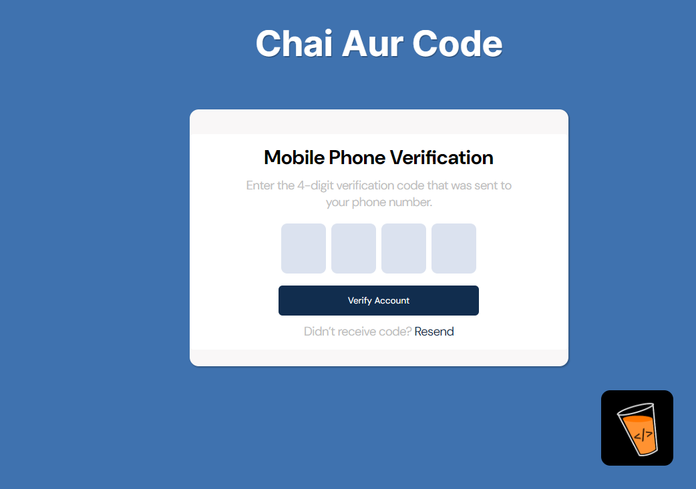
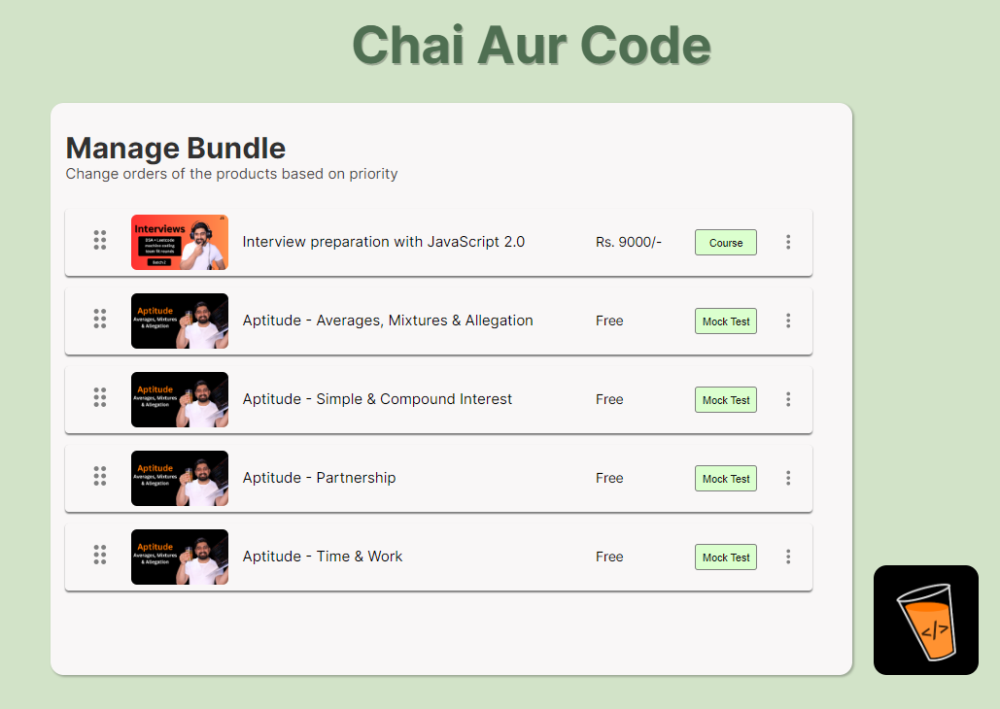
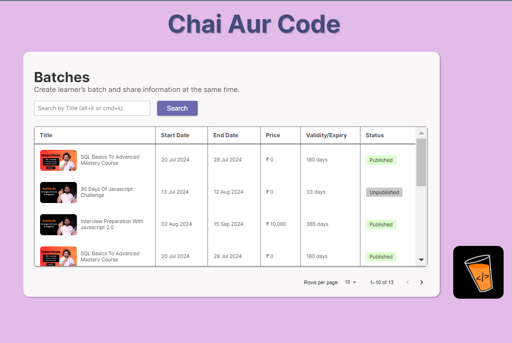

# Matser Ji (Chai Aur Code) Assignment1

Welcome to the Matser Ji (Chai Aur Code) Assignment1 project, a comprehensive web application designed to showcase three core functionalities: OTP Form, Drag-and-Drop Cards, and Data Table management.


## Features

- OTP Form :
    A user-friendly form to handle OTP submissions. Implements validation and error handling for a smooth user experience.
- Drag-and-Drop Cards : An interactive drag-and-drop interface to manage course cards. Enhances user interaction with seamless card positioning and reordering.
- Data Table : A dynamic table to display and manage batch data. Supports pagination, search, and customized table cells for better data representation.


## Screenshots







## Demo

https://master-ji-chai-aur-code-1.vercel.app/

## Installation

Install project with npm

```bash
  npm install my-project
  cd my-project
```
```bash 
  npm run dev
```
    
